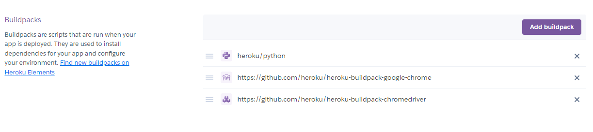
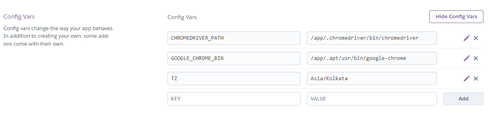

# iNeuron Courses Scrapping

- Objective of this project is scrapping all course informations from [iNeuron](https://ineuron.ai/) website and store them in a database

## Database
- MongoDB database has been used to store all course informations and application logging

## :hammer_and_wrench: Requirements
- python3.x
- Flask
- selenium
- beautifulsoup4
- APScheduler
- pymongo[srv]

## :gear: Heroku Setup

- Python (Select it from the officially supported buildpacks)
- Headless Google Chrome: https://github.com/heroku/heroku-buildpack-google-chrome
- Chromedriver: https://github.com/heroku/heroku-buildpack-chromedriver

- `CHROMEDRIVER_PATH` = `/app/.chromedriver/bin/chromedriver`
- `GOOGLE_CHROME_BIN` = `/app/.apt/usr/bin/google-chrome`
- `TZ` = `Asia/Kolkata` (This is for setting timezone)

## NOTE
- This code is for running on cloud
- To run this code in local machine, make some changes inside **ScheduledScrapping.py** under **ScheduledScrapper**
    - Remove `self.chrome_options.binary_location = os.environ.get("GOOGLE_CHROME_BIN")` and `self.driver_path=os.environ.get("CHROMEDRIVER_PATH")`
    - Then add `self.driver_path = './chromedriver'`
    - The above path will only work if you had installed driver in the same directory/folder, else use the path where you had installed in driver_path.
